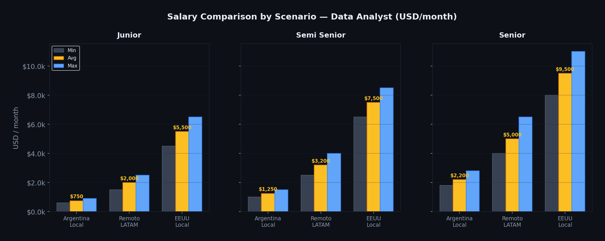
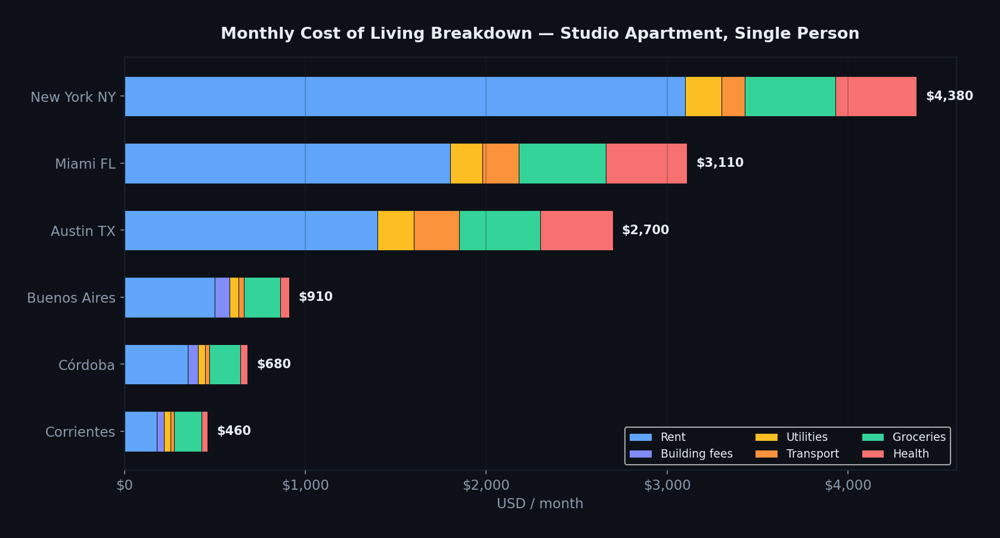
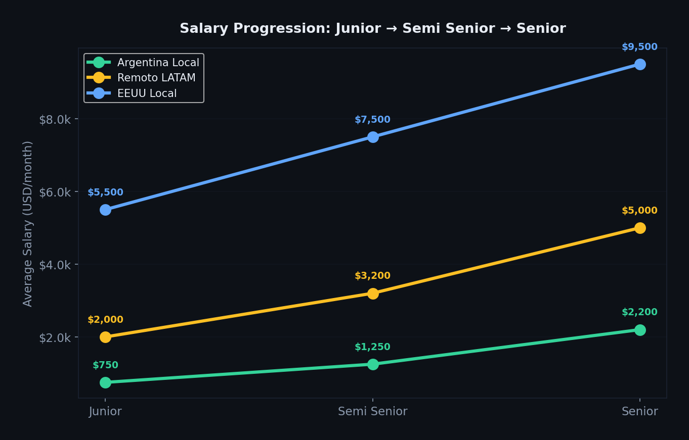
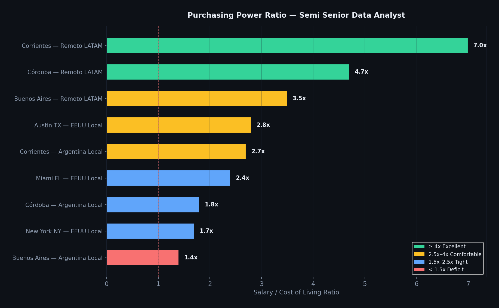
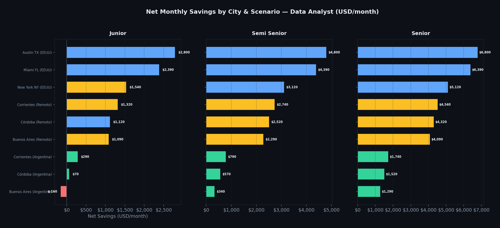
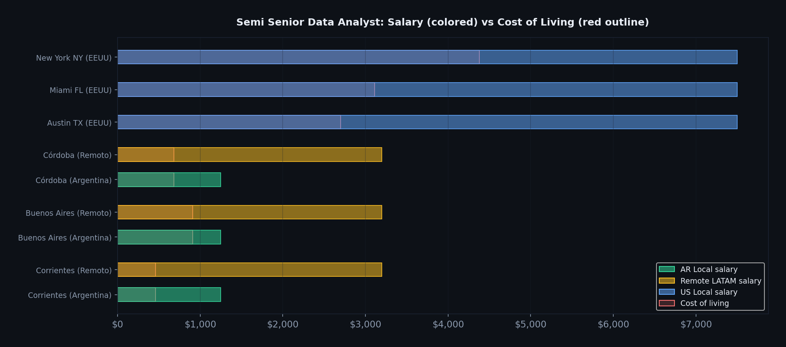

# 💰 Salary vs. Cost of Living — Data Analyst: Argentina, USA & Remote LATAM

     -fbbf24)

[](https://facurboll.github.io/da-salary-vs-cost-of-living-2025/)

> **🇪🇸 Versión en español abajo | 🇺🇸 English version first**

---

## 🇺🇸 English

### Overview

A data-driven comparison of **Data Analyst salaries vs. cost of living** across three employment scenarios:

| Scenario | Description |
|---|---|
| 🇦🇷 **Argentina Local** | On-site roles at Argentine companies (large & SMEs) |
| 🌎 **Remote LATAM** | Remote contractor for US/EU companies, paid in USD |
| 🇺🇸 **USA Local** | On-site roles at US companies |

Analyzed across **3 seniority levels** (Junior, Semi Senior, Senior) and **6 cities** (Corrientes, Buenos Aires, Córdoba, Austin TX, Miami FL, New York NY), covering rent, building fees, utilities, transportation, groceries, and health insurance.

### Key Findings

| Insight | Detail |
|---|---|
| 🏆 **Best purchasing power** | Remote LATAM from Corrientes: **7.0x** salary-to-cost ratio (Semi Senior) |
| 💸 **AR Local vs Remote gap** | Remote pays **2.6x** more than local Argentine positions |
| 🏥 **Hidden US cost** | Health insurance adds **$400-450/month** — a cost that doesn't exist in Argentina |
| 🗽 **NYC surprise** | A Semi Senior in NYC saves **$3,120/mo** — less than a Remote worker from Buenos Aires ($2,290/mo) |
| 🤠 **Austin = US sweet spot** | Rent 55% lower than NYC, no state income tax, strong tech ecosystem |

### Charts

#### Salary Ranges by Scenario and Seniority


#### Cost of Living Breakdown by City


#### Salary Growth Curve Junior to Senior


#### Purchasing Power Ratio (Semi Senior)


#### Net Monthly Savings by City and Scenario


#### Salary vs Cost Side-by-Side


### Interactive Dashboard

An interactive dashboard is deployed on GitHub Pages with:
- Toggle between Junior / Semi Senior / Senior
- Dynamic KPIs, insights, and all chart types
- Tangible purchasing power table (months to buy an iPhone, laptop, car, etc.)

👉 **[Open Live Dashboard](https://facurboll.github.io/da-salary-vs-cost-of-living-2025/)**

### Dataset

- **File:** [`data/salary_vs_cost_of_living_2025.csv`](data/salary_vs_cost_of_living_2025.csv)
- **Records:** 27 (3 scenarios x 3 seniority levels x 3 cities per scenario)
- **Dictionary:** [`data/data_dictionary.csv`](data/data_dictionary.csv)
- **FX Rate:** ARS 1,400/USD (blue/MEP, April 2026)

### How to Run

```bash
git clone https://github.com/facurboll/da-salary-vs-cost-of-living-2025.git
cd da-salary-vs-cost-of-living-2025
pip install -r requirements.txt
python scripts/analyze.py
```

### Sources

**Salary data:**
- Argentina: SysArmy IT Survey, HuCap (iProfesional), Glassdoor AR, Coderhouse, Talently
- Remote LATAM: Near Salary Guide 2025/26, Interfell Smart Hiring 2025, RemoteRocketship (653 postings), Tecla, GetOnBoard, Atlas
- USA: US Bureau of Labor Statistics, Glassdoor, Indeed, Salary.com, ZipRecruiter

**Cost of living data:**
- Argentina: Zonaprop (Q1 2026), Infobae, INDEC (CBT Feb 2026: ARS 1,397,672/family)
- USA: RentCafe, ApartmentList, Apartments.com, C2ER Cost of Living Index, KFF (health insurance)

### Disclaimer

> This analysis uses **synthetic data calibrated against public sources** for educational and portfolio purposes. Actual values vary by employer, negotiation, benefits, taxes, contract type, and individual context. This is not financial or career advice.

---

## 🇪🇸 Español

### Resumen

Comparación basada en datos de **salarios de Data Analyst vs. costo de vida** en tres escenarios laborales:

| Escenario | Descripción |
|---|---|
| 🇦🇷 **Argentina Local** | Puestos presenciales en empresas argentinas (grandes y PyMEs) |
| 🌎 **Remoto LATAM** | Contractor remoto para empresas US/EU, cobro en USD |
| 🇺🇸 **EEUU Local** | Puestos presenciales en empresas estadounidenses |

Analizado en **3 niveles de seniority** (Junior, Semi Senior, Senior) y **6 ciudades** (Corrientes, Buenos Aires, Córdoba, Austin TX, Miami FL, New York NY), cubriendo alquiler de monoambiente, expensas, servicios, transporte, canasta básica y salud.

### Hallazgos Clave

| Insight | Detalle |
|---|---|
| 🏆 **Mejor poder adquisitivo** | Remoto LATAM desde Corrientes: ratio **7.0x** (Semi Senior) |
| 💸 **Brecha AR local vs Remoto** | Remoto paga **2.6x** más que posiciones locales argentinas |
| 🏥 **Costo oculto de EEUU** | Health insurance suma **$400-450/mes** — costo inexistente en Argentina |
| 🗽 **Sorpresa NYC** | Un Semi Senior en NYC ahorra **$3.120/mes** — menos que un remoto desde Buenos Aires ($2.290/mes) |
| 🤠 **Austin = sweet spot de EEUU** | Alquiler 55% menor que NYC, sin impuesto estatal, ecosistema tech fuerte |

### Dashboard Interactivo

👉 **[Abrir Dashboard](https://facurboll.github.io/da-salary-vs-cost-of-living-2025/)**

### Cómo ejecutar

```bash
git clone https://github.com/facurboll/da-salary-vs-cost-of-living-2025.git
cd da-salary-vs-cost-of-living-2025
pip install -r requirements.txt
python scripts/analyze.py
```

### Fuentes

**Datos salariales:**
- Argentina: SysArmy, HuCap (iProfesional: Jr $1.58M bruto/mes, Sr $3.71M bruto/mes), Glassdoor AR, Coderhouse, Talently
- Remoto LATAM: Near Salary Guide 2025/26, Interfell Smart Hiring 2025, RemoteRocketship (avg $63,337/año), Tecla, GetOnBoard, Atlas
- EEUU: BLS, Glassdoor ($93K avg), Indeed ($85K avg), Salary.com ($97.7K mediana), ZipRecruiter (Jr $79K avg)

**Datos de costo de vida:**
- Argentina: Zonaprop Q1 2026 (mono CABA $704.704 = ~$500 USD), Infobae, INDEC (CBT feb 2026: $1.397.672 familia tipo). Corrientes estimado ~35-40% de CABA.
- EEUU: RentCafe, ApartmentList, Apartments.com, C2ER Index, KFF (health insurance)

**Tipo de cambio:** ARS 1.400/USD (blue/MEP abril 2026, flotación con bandas).

### Disclaimer

> Este análisis utiliza **datos sintéticos calibrados contra fuentes públicas** con fines educativos y de portafolio profesional. Los valores reales varían según empleador, negociación, beneficios, impuestos, tipo de contrato y contexto individual. No constituye asesoramiento financiero ni laboral.

---

### Author

**Facundo Ramírez Boll** — Contador Público & Data Analyst
📍 Corrientes, Argentina
🔗 [GitHub](https://github.com/facurboll) · [LinkedIn](https://www.linkedin.com/in/facundoramirezboll/)

### Tech Stack

`Python` · `Pandas` · `Matplotlib` · `React` · `Recharts` · `SQL` · `CSV`
